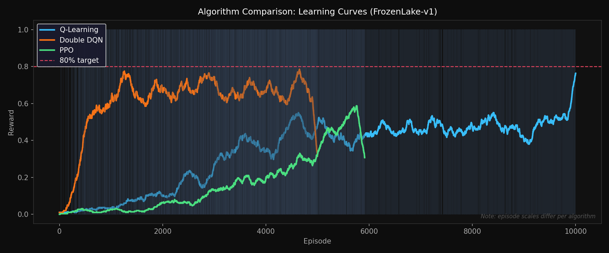
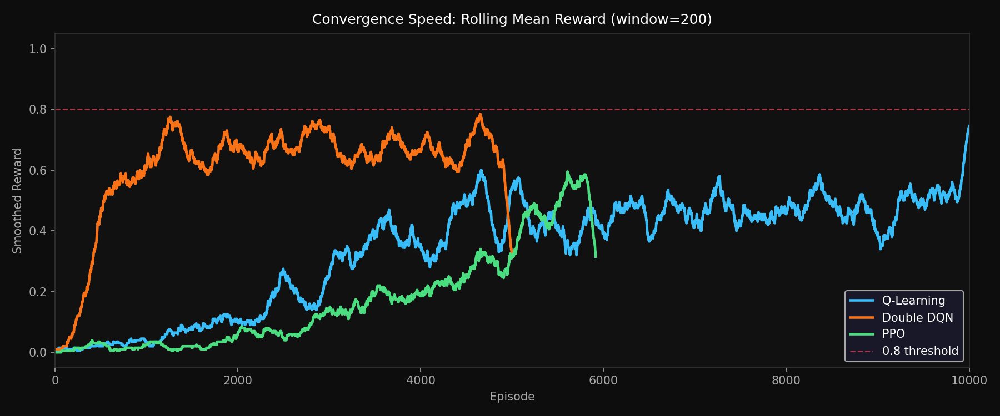
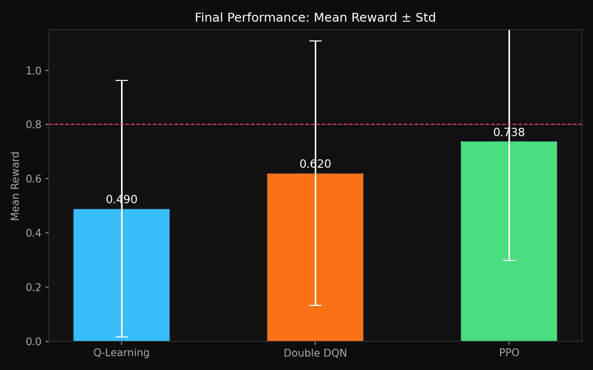
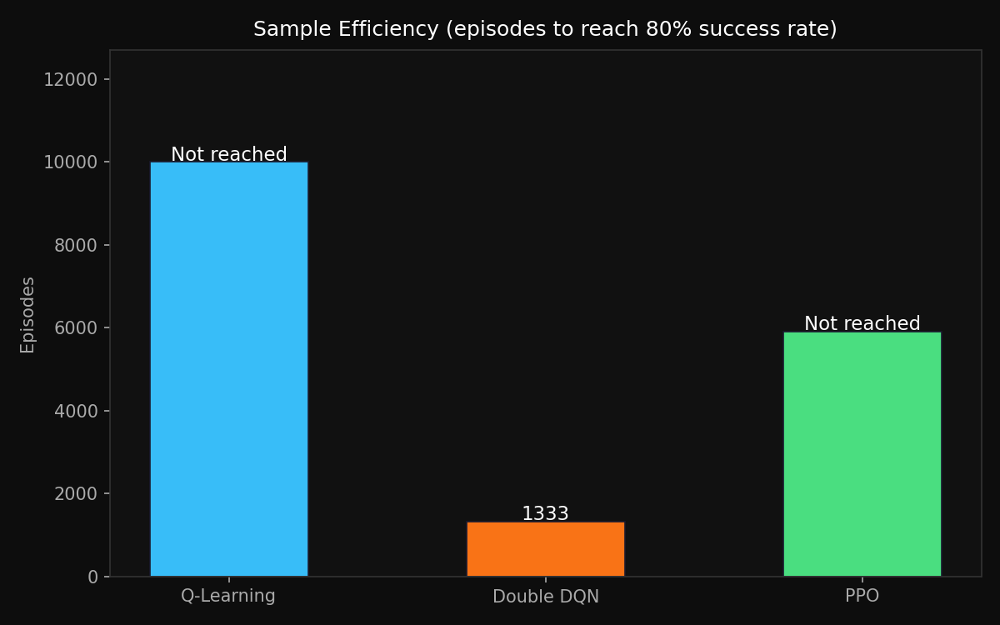
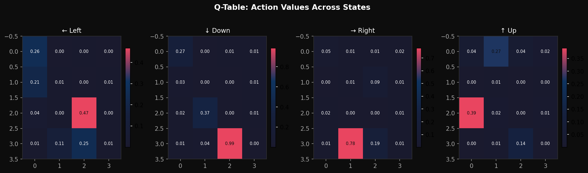
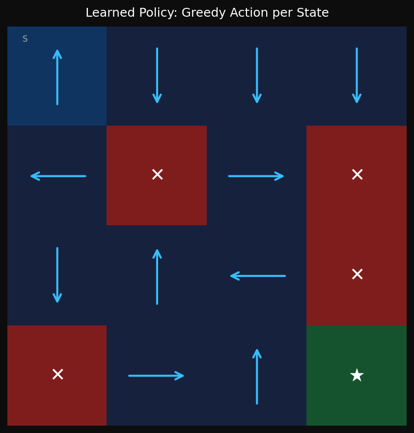

# Reinforcement Learning for Autonomous Navigation: A Comparative Study


[](https://colab.research.google.com/drive/1GfAYuqjPsox8bcs1t0LcdO1JMQkwIB4y?usp=sharing)

---

## Abstract

This repository presents a systematic empirical comparison of three reinforcement learning algorithms  **Tabular Q-Learning**, **Double Deep Q-Network (DDQN)**, and **Proximal Policy Optimization (PPO)**  applied to the stochastic FrozenLake-v1 navigation task. We analyse convergence behaviour, sample efficiency, and final policy quality across 10,000 training episodes for Q-Learning, 5,000 for Double DQN, and 100,000 timesteps for PPO. All algorithms are evaluated using an unbiased 500-episode greedy policy evaluation after training, separating exploration-noise-corrupted training rewards from true policy performance. The framework is modular: replace FrozenLake with any Gymnasium-compatible environment and all analysis pipelines run unchanged.

---

## Problem Formulation

### Markov Decision Process

The navigation task is formalised as a tuple $\mathcal{M} = (\mathcal{S}, \mathcal{A}, \mathcal{P}, \mathcal{R}, \gamma)$:

| Symbol | Definition | FrozenLake-v1 Instantiation |
|--------|------------|------------------------------|
| $\mathcal{S}$ | State space | 16 discrete positions on a 4×4 grid |
| $\mathcal{A}$ | Action space | 4 cardinal directions: {←, ↓, →, ↑} |
| $\mathcal{P}(s'\|s,a)$ | Transition probability | Stochastic: 1/3 chance of lateral slip |
| $\mathcal{R}(s,a,s')$ | Reward function | +1 at goal, 0 everywhere else |
| $\gamma$ | Discount factor | 0.95 (Q-Learning), 0.99 (DDQN/PPO) |

The agent must navigate from start (S) to goal (G) while avoiding holes (H) on a slippery surface. The stochastic transition model makes this a non-trivial credit assignment problem  the agent cannot simply memorise a deterministic path.

### Objective

Find policy $\pi^*$ maximising the expected discounted return:

$$\pi^* = \arg\max_\pi \mathbb{E}_\pi \left[ \sum_{t=0}^{T} \gamma^t r_t \right]$$

---

## Methods

### 1. Tabular Q-Learning

Q-Learning (Watkins & Dayan, 1992) maintains an explicit value table $Q \in \mathbb{R}^{|\mathcal{S}| \times |\mathcal{A}|}$ updated via the **Bellman optimality equation**:

$$Q(s, a) \leftarrow Q(s, a) + \alpha \left[ r + \gamma \max_{a'} Q(s', a') - Q(s, a) \right]$$

where $\alpha = 0.8$ and $\gamma = 0.95$. Exploration uses $\varepsilon$-greedy with exponential decay: $\varepsilon_t = \varepsilon_0 \cdot e^{-\lambda t}$.

**Complexity:**
- Space: $O(|\mathcal{S}||\mathcal{A}|) = O(64)$
- Per-update: $O(1)$  a single table lookup and scalar write

---

### 2. Double Deep Q-Network (DDQN)

DQN (Mnih et al., 2015) approximates $Q(s, a; \theta)$ with a neural network and introduces two stability mechanisms:

**Experience Replay** - transitions $(s, a, r, s', d)$ are stored in a circular buffer of capacity $N = 10{,}000$ and sampled uniformly. This breaks temporal correlations that destabilise gradient updates.

**Target Network** - a frozen copy $\hat{\theta}$ is used for TD targets, synced every 100 gradient steps. Without this, the network chases a non-stationary target and training diverges.

Standard DQN has a well-known positive bias: it uses the same (target) network to both *select* and *evaluate* the greedy next action, systematically overestimating Q-values. The **Double DQN** fix (van Hasselt et al., 2016) decouples the two:

$$\mathcal{L}(\theta) = \mathbb{E} \left[ \left( r + \gamma \cdot Q\!\left(s',\; \underbrace{\arg\max_{a'} Q(s',a';\,\theta)}_{\text{policy net selects}};\; \hat{\theta} \right) - Q(s,a;\theta) \right)^2 \right]$$

This is a two-line code change that meaningfully reduces overestimation on sparse-reward MDPs.

**Network architecture:** Linear(16→64) → ReLU → Linear(64→64) → ReLU → Linear(64→4)

**Complexity:**
- Space: O(N_buffer) = O(10,000) transitions
- Per-update: O(batch_size) = O(64)

---

### 3. Proximal Policy Optimization (PPO)

PPO (Schulman et al., 2017) directly optimises a clipped surrogate objective that prevents destructively large policy updates:

$$\mathcal{L}^{\text{CLIP}}(\theta) = \mathbb{E}_t \left[ \min \left( r_t(\theta)\,\hat{A}_t,\;\; \text{clip}(r_t(\theta),\, 1-\varepsilon,\, 1+\varepsilon)\,\hat{A}_t \right) \right]$$

where $r_t(\theta) = \pi_\theta(a_t|s_t)\,/\,\pi_{\theta_{\text{old}}}(a_t|s_t)$ is the probability ratio and $\hat{A}_t$ is the advantage estimate. The clip parameter $\varepsilon = 0.2$ prevents the policy from changing too drastically in a single update, critical on sparse-reward tasks where a few lucky rollouts would otherwise dominate the gradient.

Training uses $N_{\text{envs}} = 4$ parallel environments collecting 512 steps per rollout.

**Complexity:**
- Space: $O(n_{\text{steps}} \times N_{\text{envs}}) = O(2048)$ per rollout
- Per-update: $O(n_{\text{steps}} \times n_{\text{epochs}}) = O(5120)$

---

## Algorithm Complexity Summary

| Algorithm | Space Complexity | Per-Update Complexity | Requires Replay Buffer |
|-----------|-----------------|----------------------|------------------------|
| Q-Learning | O(\|S\|\|A\|) | O(1) | No |
| Double DQN | O(N_buffer) | O(batch_size) | Yes |
| PPO | O(n_steps × N_envs) | O(n_steps × n_epochs) | No (on-policy) |

---

## Results


| Algorithm | Mean Reward | Final-100 Mean | Greedy Success Rate | Convergence Episode |
|-----------|-------------|----------------|---------------------|---------------------|
| Q-Learning | 0.3377 | 0.4900 | 56.6% | Not reached |
| Double DQN | 0.6092 | 0.6200 | - | Episode 1278 |
| PPO | 0.1676 | 0.6300 | 73.8% | Not reached |

*Full results also saved to `results/comparison_results.csv`.*

---

## Visualisations

After running `main.py`, the following outputs are generated in `results/`:

| File | Description |
|------|-------------|
| `compare_learning_curves.png` | Reward per episode for all three algorithms |
| `compare_convergence.png` | Convergence speed comparison |
| `compare_final_performance.png` | Final performance bar chart |
| `compare_sample_efficiency.png` | Reward vs environment steps |
| `qtable_heatmap.png` | Q-table value heatmap (Q-Learning) |
| `policy_arrows.png` | Learned policy visualised on the grid |
| `navigation_path.gif` | Animated navigation path of the best policy |

### Learning Curves


### Convergence Speed


### Final Performance


### Sample Efficiency


### Q-Table Heatmap


### Learned Policy


### Navigation GIF


---

## Connection to Applied Research

This work extends my applied research at **The Leadership 30**, where I lead data-driven analysis of climate and disaster-response indicators across Maharashtra. A recurring challenge is coordinating physical delivery of resources to flood-isolated communities where road access is compromised. Autonomous navigation agents  trained with algorithms like those benchmarked here  form the decision-making core for drone-based emergency delivery systems. The stochastic MDP formulation studied here mirrors real operational uncertainty: sensor noise, wind disturbance, and partial observability in field deployments.

---

## Repository Structure

```
rl-autonomous-navigation/
├── main.py                   ← Run everything (recommended entry point)
├── run_all.py                ← Subprocess-based sequential runner
├── q_learning.py             ← Tabular Q-Learning from scratch
├── dqn_agent.py              ← Double DQN (PyTorch)
├── ppo_agent.py              ← PPO (stable-baselines3)
├── compare_algorithms.py     ← Comparison plots and CSV
├── utils.py                  ← Shared visualisation and metrics utilities
├── requirements.txt
├── .gitignore
├── LICENSE
└── results/                  ← Created at runtime
    ├── ql_results.pkl
    ├── dqn_results.pkl
    ├── ppo_results.pkl
    ├── dqn_model.pth
    ├── ppo_model.zip
    ├── qtable_heatmap.png
    ├── policy_arrows.png
    ├── navigation_path.gif
    ├── compare_learning_curves.png
    ├── compare_sample_efficiency.png
    ├── compare_final_performance.png
    ├── compare_convergence.png
    └── comparison_results.csv
```

---

## Setup & Usage

### Requirements

- Python 3.10 or higher
- Windows 10/11, macOS, or Linux

### Installation

```bash
# 1. Clone the repository
git clone https://github.com/ajinkya-awari/rl-autonomous-navigation.git
cd rl-autonomous-navigation

# 2. Create and activate a virtual environment
python -m venv venv
venv\Scripts\activate        # Windows
# source venv/bin/activate   # macOS / Linux

# 3. Install dependencies
pip install -r requirements.txt
```

### Running

```bash
# Run everything in sequence (recommended)
python main.py

# Or run individual modules
python q_learning.py
python dqn_agent.py
python ppo_agent.py
python compare_algorithms.py   # requires the three pkl files above
```

All outputs are written to the `results/` directory.

---

## References

1. **Watkins, C. J. C. H. & Dayan, P.** (1992). Q-learning. *Machine Learning*, 8(3–4), 279–292. https://doi.org/10.1007/BF00992698

2. **Mnih, V. et al.** (2015). Human-level control through deep reinforcement learning. *Nature*, 518(7540), 529–533. https://doi.org/10.1038/nature14236

3. **van Hasselt, H., Guez, A. & Silver, D.** (2016). Deep Reinforcement Learning with Double Q-learning. *AAAI Conference on Artificial Intelligence*. https://arxiv.org/abs/1509.06461

4. **Schulman, J. et al.** (2017). Proximal Policy Optimization Algorithms. *arXiv preprint arXiv:1707.06347*. https://arxiv.org/abs/1707.06347

5. **Sutton, R. S. & Barto, A. G.** (2018). *Reinforcement Learning: An Introduction* (2nd ed.). MIT Press. http://incompleteideas.net/book/the-book-2nd.html

6. **Raffin, A. et al.** (2021). Stable-Baselines3: Reliable Reinforcement Learning Implementations. *Journal of Machine Learning Research*, 22(268), 1–8. https://jmlr.org/papers/v22/20-1364.html

---

## Citation

```bibtex
@misc{awari2025rl_navigation,
  author       = {Awari, Ajinkya},
  title        = {Reinforcement Learning for Autonomous Navigation:
                  A Comparative Study of Q-Learning, Double DQN, and PPO},
  year         = {2026},
  publisher    = {GitHub},
  howpublished = {\url{https://github.com/ajinkya-awari/rl-autonomous-navigation}},
}
```

---

## License

MIT - see [LICENSE](LICENSE).
